# LABORATORIO 5 CVDS

## Escuela Colombiana de Ingeniería

## Introducción a proyectos Web

#### Stefania Giraldo Buitrago

# Parte I. - Jugando a ser un cliente HTTP

1.  Abra una terminal Linux o consola de comandos Windows.
	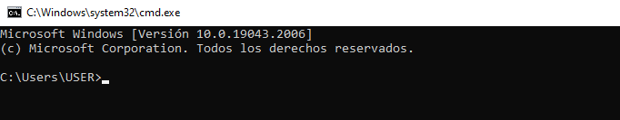
2.  Realice una conexión síncrona TCP/IP a través de Telnet al siguiente servidor:
    
    -   Host: www.escuelaing.edu.co
    -   Puerto: 80
    
    Teniendo en cuenta los parámetros del comando telnet:
    
    ```
    telnet HOST PORT
    ```
	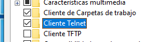
	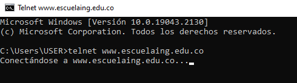
	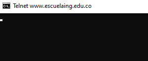
3.  Antes de que el servidor cierre la conexión por falta de comunicación:
    -   Revise la página 36 del [RFC del protocolo HTTP](https://tools.ietf.org/html/rfc2616), sobre cómo realizar una petición GET. Con esto, solicite al servidor el recurso ‘sssss/abc.html’, usando la versión 1.0 de HTTP.
    -   Asegúrese de presionar ENTER dos veces después de ingresar el comando.
    -   Revise el resultado obtenido. 
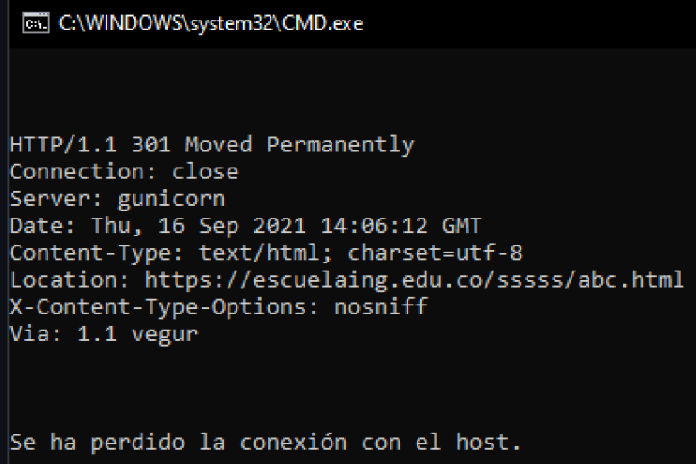
    
    ¿Qué codigo de error sale?, revise el significado del mismo en [la lista de códigos de estado HTTP](https://en.wikipedia.org/wiki/List_of_HTTP_status_codes).
  	
 El codigo que salio fue el 301 lo que significa que Se movio el recurso de manera permanente
    -   ¿Qué otros códigos de error existen?, ¿En qué caso se manejarán?
    
    -400 Peticion incorrecta: El servidor no logro encontrar o procesar la solicitud por un error aparente del cliente como sintaxis, tamaño o enrutamiento
    -401 No autorizado: es similar al error 403, se trata del error lanzado cuando la autentificacion no se proporciono o es incorrecta
    -402 Pago rquerido: Este codigo esta reservado para uso futuro, en el cual se puedan notificar errores en pagos digitales, pero actualmente algunas empresas lo han utilizado para expresas otras cosas como Google debelopers que lo usa en caso de que el usuario haya superado el limite diario de solicitudes
    -403 Prohibido: La solicitud realzada es correcta debido a que si tiene los datos validos y el servidor la entiende, pero el servidor la esta rechazando, esto puede darse por gestion de permisos, necesita una cuenta especifica o son acciones prohibidas
    -404 No encontrado: No fue posible encontrar el recurso solicitado

4.  Realice una nueva conexión con telnet, esta vez a:
    
    -   Host: www.httpbin.org
    -   Puerto: 80
    -   Versión HTTP: 1.1
    
    Ahora, solicite (GET) el recurso _/html_. ¿Qué se obtiene como resultado?
	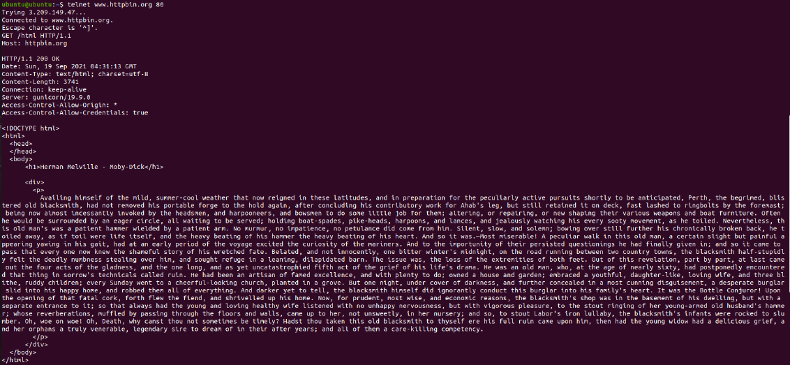
    

¡Muy bien!, ¡Acaba de usar del protocolo HTTP sin un navegador Web!. Cada vez que se usa un navegador, éste se conecta a un servidor HTTP, envía peticiones (del protocolo HTTP), espera el resultado de las mismas, y -si se trata de contenido HTML- lo interpreta y dibuja.
luego copiamos y pegamos el contenido en archivo llamado contenido.txt

5.  Seleccione el contenido `HTML` de la respuesta y copielo al cortapapeles `CTRL-SHIFT-C`. Ejecute el comando `wc` (_word count_) para contar palabras con la opción `-c` para contar el número de caracteres:
    
    ```
    wc -c 
    ```
    
    Pegue el contenido del portapapeles con `CTRL-SHIFT-V` y presione `CTRL-D` (fin de archivo de Linux). Si no termina el comando `wc` presione `CTRL-D` de nuevo. No presione mas de dos veces `CTRL-D` indica que se termino la entrada y puede cerrarle la terminal. Debe salir el resultado de la cantidad de caracteres que tiene el contenido HTML que respondió el servidor.

    

    Claro está, las peticiones GET son insuficientes en muchos casos. Investigue: 
	¿Cuál es la diferencia entre los verbos GET y POST? 
    	
	los dos son protocolos de http los cuales envian al servidor peticiones, Get permite obtener informacion
	del servidor y POST envia informacion desde el cliente para que se procesada y se actualice
	¿Qué otros tipos de peticiones existen?
	
     En el tipo de petición GET los parámetros URL se guardan junto al URL mientras que con POST no. Por lo que POST ofrece mayor discreción debido a que tampoco se guardan los parámetros URL en el caché ni en el registro del servidor caso contrario en GET que se guardan sin cifrar.
    - OPTIONS
        - HEAD solo revisa los headers
	- POST envia datos al programa ubicado en la url especifica
        - PUT deposita en la ubicación de destino
        - DELETE elimina en la ubicación de destino
        - CONNECT Esta petición es usada para establecer una conexión de red con un servidor web mediante HTTP.
        

6.  En la practica no se utiliza `telnet` para hacer peticiones a sitios web sino el comando `curl` con ayuda de la linea de comandos:
    
    ```
    curl www.httpbin.org
    ```
    

    Utilice ahora el parámetro `-v` y con el parámetro `-i`:
    
    ```
    curl -v www.httpbin.org
    ```
    
    ```
    curl -i www.httpbin.org
    ```
    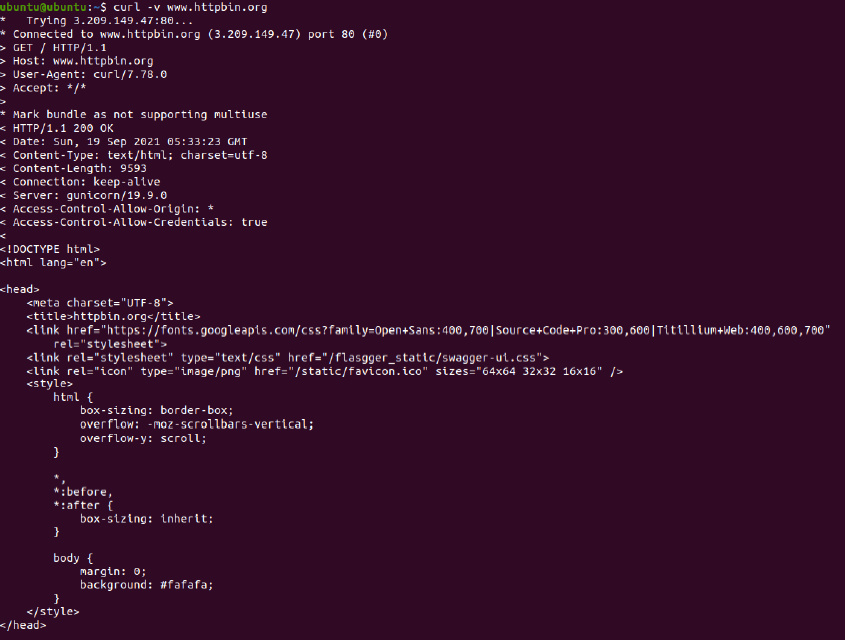
    ¿Cuáles son las diferencias con los diferentes parámetros?
    - curl -v: Make the operation more talkative
	El comando curl -v nos permite obtener el encabezado de la solicitud y el número de la
	respuesta obtenida.
    - curl -i: Include protocol response headers in the output

	El comando curl -i incluye el encabezado HTTP en la salida. El encabezado HTTP incluye cosas como nombre del servidor, fecha del documento, versión HTTP

# Parte II. - Haciendo una aplicación Web dinámica a bajo nivel.

En este ejercicio, va a implementar una aplicación Web muy básica, haciendo uso de los elementos de más bajo nivel de Java-EE (Enterprise Edition), con el fin de revisar los conceptos del protocolo HTTP. En este caso, se trata de un módulo de consulta de clientes Web que hace uso de una librería de acceso a datos disponible en un repositorio Maven local.

I. Para esto, cree un proyecto maven nuevo usando el arquetipo de aplicación Web estándar maven-archetype-webapp y realice lo siguiente:

1.  Revise la clase SampleServlet incluida a continuacion, e identifique qué hace:
    
    ```
    package edu.eci.cvds.servlet;
    
    import java.io.IOException;
    import java.io.Writer;
    import java.util.Optional;
    import javax.servlet.ServletException;
    import javax.servlet.annotation.WebServlet;
    import javax.servlet.http.HttpServlet;
    import javax.servlet.http.HttpServletRequest;
    import javax.servlet.http.HttpServletResponse;
    
    @WebServlet(
        urlPatterns = "/helloServlet"
    )
    public class SampleServlet extends HttpServlet{
        static final long serialVersionUID = 35L;
    
        @Override
       protected void doGet(HttpServletRequest req, HttpServletResponse resp) throws ServletException, IOException {
           Writer responseWriter = resp.getWriter();
           Optional<String> optName = Optional.ofNullable(req.getParameter("name"));
           String name = optName.isPresent() && !optName.get().isEmpty() ? optName.get() : "";
    
           resp.setStatus(HttpServletResponse.SC_OK);
           responseWriter.write("Hello" + name + "!");
           responseWriter.flush();
       }
    }
    ```
    
    Revise qué valor tiene el parámetro ‘urlPatterns’ de la anotación [@WebServlet](http://docs.oracle.com/javaee/6/tutorial/doc/bnafu.html), pues este indica qué URLs atiende las peticiones el servlet.
	- aqui se puede acceder a SampleServlet a traves de el patron de URL: /helloServlet
	- al solicitar algo a la pagina y si logra conectar se mostrara hello + lo que se le ponga
2.  En el pom.xml, modifique la propiedad "packaging" con el valor "war". Agregue la siguiente dependencia:
    
    ```
    <dependency>
         <groupId>javax</groupId>
         <artifactId>javaee-web-api</artifactId>
         <version>7.0</version>
         <scope>provided</scope>
    </dependency>
    ```
    
    y agregue la seccion build al final del tag `project` en el archivo `pom.xml`:
    
    ```
    <build>
       <plugins>
           <plugin>
               <groupId>org.apache.maven.plugins</groupId>
               <artifactId>maven-compiler-plugin</artifactId>
               <version>3.8.0</version>
               <configuration>
                   <source>1.8</source>
                   <target>1.8</target>
               </configuration>
           </plugin>
           <plugin>
               <groupId>org.apache.maven.plugins</groupId>
               <artifactId>maven-war-plugin</artifactId>
               <version>2.3</version>
               <configuration>
                   <failOnMissingWebXml>false</failOnMissingWebXml>
               </configuration>
           </plugin>
           <plugin>
               <groupId>org.apache.maven.plugins</groupId>
               <artifactId>maven-dependency-plugin</artifactId>
               <version>2.6</version>
               <executions>
                   <execution>
                       <phase>validate</phase>
                       <goals>
                           <goal>copy</goal>
                       </goals>
                       <configuration>
                           <silent>true</silent>
                           <artifactItems>
                               <artifactItem>
                                   <groupId>javax</groupId>
                                   <artifactId>javaee-endorsed-api</artifactId>
                                   <version>7.0</version>
                                   <type>jar</type>
                               </artifactItem>
                           </artifactItems>
                       </configuration>
                   </execution>
               </executions>
           </plugin>
    
           <!-- Tomcat embedded plugin. -->
           <plugin>
               <groupId>org.apache.tomcat.maven</groupId>
               <artifactId>tomcat7-maven-plugin</artifactId>
               <version>2.2</version>
               <configuration>
                   <port>8080</port>
                   <path>/</path>
               </configuration>
           </plugin>
       </plugins>
    </build>
    ```

3.  Revise en el pom.xml para qué puerto TCP/IP está configurado el servidor embebido de Tomcat (ver sección de plugins).

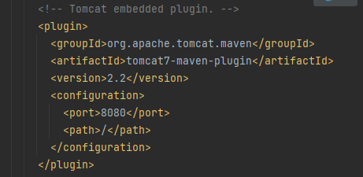
    
4.  Compile y ejecute la aplicación en el servidor embebido Tomcat, a través de Maven con:
    
    ```
    mvn package
    ```
    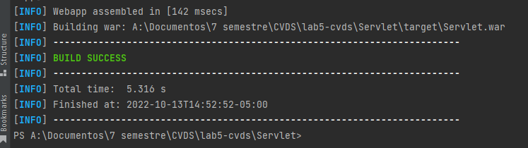
    ```
    mvn tomcat7:run
    ```
    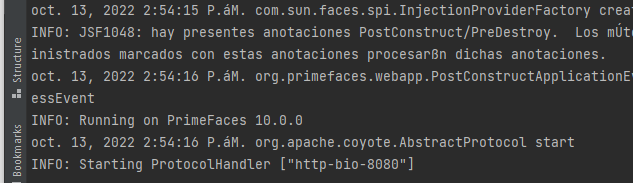

    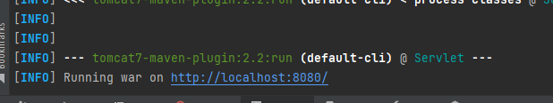
    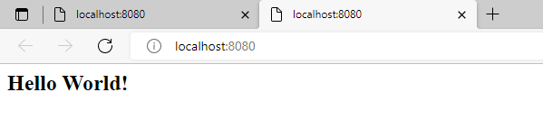

5.  Abra un navegador, y en la barra de direcciones ponga la URL con la cual se le enviarán peticiones al ‘SampleServlet’. Tenga en cuenta que la URL tendrá como host ‘localhost’, como puerto, el configurado en el pom.xml y el path debe ser el del Servlet. Debería obtener un mensaje de saludo.

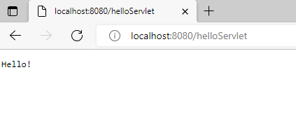
    
6.  Observe que el Servlet ‘SampleServlet’ acepta peticiones GET, y opcionalmente, lee el parámetro ‘name’. Ingrese la misma URL, pero ahora agregando un parámetro GET (si no sabe como hacerlo, revise la documentación en http://www.w3schools.com/tags/ref_httpmethods.asp).

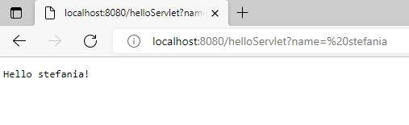

7.  Busque el artefacto `gson` en el repositorio de `maven` y agregue la dependencia.
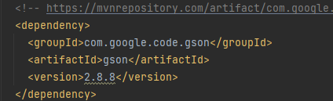
8.  En el navegador revise la dirección [https://jsonplaceholder.typicode.com/todos/1](https://jsonplaceholder.typicode.com/todos/1). Intente cambiando diferentes números al final del `path` de la url.

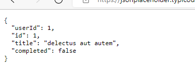

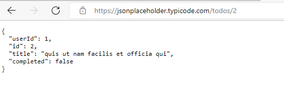

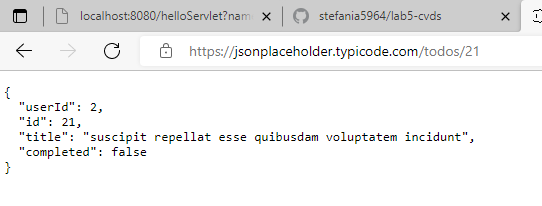

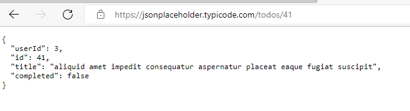
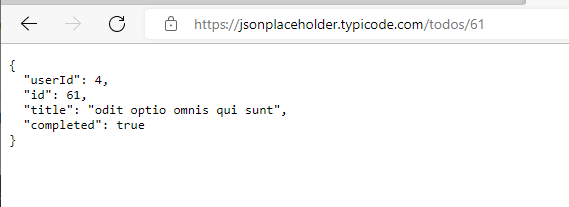

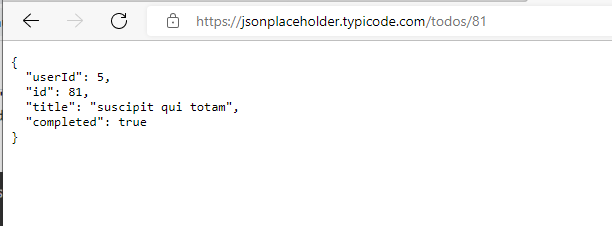
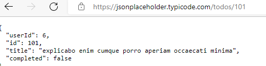
cada 20 id cambia el userid

9.  Basado en la respuesta que le da el servicio del punto anterior, cree la clase `edu.eci.cvds.servlet.model.Todo` con un constructor vacío y los métodos `getter` y `setter` para las propiedades de los "To Dos" que se encuentran en la url indicada.
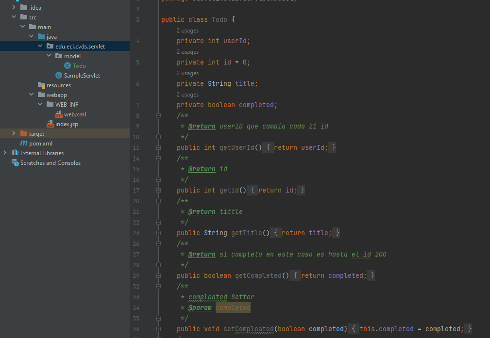
    
10.  Utilice la siguiente clase para consumir el servicio que se encuentra en la dirección url del punto anterior:
    
    ```
    package edu.eci.cvds.servlet;
    
    import java.io.BufferedReader;
    import java.io.IOException;
    import java.io.InputStreamReader;
    import java.net.MalformedURLException;
    import java.net.URL;
    import java.net.URLConnection;
    import java.util.List;
    
    import com.google.gson.Gson;
    
    import edu.eci.cvds.servlet.model.Todo;
    
    public class Service {
    
       public static Todo getTodo(int id) throws MalformedURLException, IOException {
           URL urldemo = new URL("https://jsonplaceholder.typicode.com/todos/" + id);
           URLConnection yc = urldemo.openConnection();
           BufferedReader in = new BufferedReader(new InputStreamReader(yc.getInputStream()));
           Gson gson = new Gson();
           Todo todo = gson.fromJson(in, Todo.class);
           in.close();
           return todo;
       }
    
       private static String todoToHTMLRow(Todo todo) {
           return new StringBuilder("<tr>")
               .append("<td>")
               .append(todo.getUserId())
               .append("</td><td>")
               .append(todo.getId())
               .append("</td><td>")
               .append(todo.getTitle())
               .append("</td><td>")
               .append(todo.getCompleted())
               .append("</td>")
               .append("</tr>")
               .toString();
       }
    
       public static String todosToHTMLTable(List<Todo> todoList) {
           StringBuilder stringBuilder = new StringBuilder("<table>")
               .append("<tr>")
               .append("<th>User Id</th>")
               .append("<th>Id</th>")
               .append("<th>Title</th>")
               .append("<th>Completed</th>")
               .append("</tr>");
    
           for (Todo todo : todoList) {
               stringBuilder.append(todoToHTMLRow(todo));
           }
    
           return stringBuilder.append("</table>").toString();
       }
    }
    ```
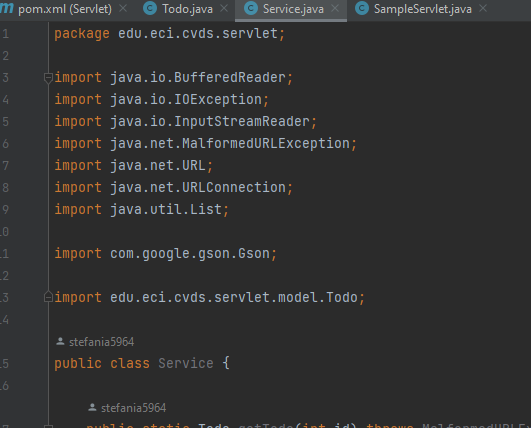
11.  Cree una clase que herede de la clase HttpServlet (similar a SampleServlet), y para la misma sobrescriba el método heredado `doGet`. Incluya la anotación `@Override` para verificar –en tiempo de compilación- que efectivamente se esté sobreescribiendo un método de las superclases.
 
12.  Para indicar en qué URL el servlet interceptará las peticiones GET, agregue al método la anotación `@WebServlet`, y en dicha anotación, defina la propiedad `urlPatterns`, indicando la URL (que usted defina) a la cual se asociará el servlet.
 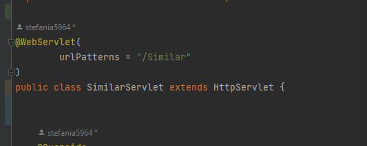  
13.  Teniendo en cuenta las siguientes métodos disponibles en los objetos ServletRequest y ServletResponse recibidos por el método doGet:
    -   response.setStatus(N); <- Indica con qué código de error N se generará la respuesta. Usar la clase HttpServletResponse para indicar el código de respuesta.
    -   request.getParameter(param); <- Consulta el parámetro recibido, asociado al nombre ‘param’.
    -   response.getWriter() <- Retorna un objeto PrintWriter a través del cual se le puede enviar la respuesta a quien hizo la petición.
    -   response.setContentType(T) <- Asigna el tipo de contenido (MIME type) que se entregará en la respuesta.
    
    Implemente dicho método de manera que:
    
    -   Asuma que la petición HTTP recibe como parámetro el número de `id` de una lista de cosas por hacer (todo), y que dicha identificación es un número entero.
    
    -   Con el identificador recibido, consulte el item por hacer de la lista de cosas por hacer, usando la clase "Service" creada en el punto 10.
        
    -   Si el item existe:
        -   Responder con el código HTTP que equivale a ‘OK’ ([ver referencia anterior](https://en.wikipedia.org/wiki/List_of_HTTP_status_codes)), y como contenido de dicha respuesta, el código html correspondiente a una página con una tabla que tenga los detalles del item, usando la clase "Service" creada en el punto 10 par crear la tabla.
    -   Si el item no existe:
        -   Responder con el código correspondiente a ‘no encontrado’, y con el código de una página html que indique que no existe un item con el identificador dado.
        -   Si no se paso parámetro opcional, o si el parámetro no contiene un número entero, devolver el código equivalente a `requerimiento inválido`.
        -   Si se genera la excepcion `MalformedURLException` devolver el código de `error interno en el servidor`
        -   Para cualquier otra excepcion, devolver el código equivalente a `requerimiento inválido`.

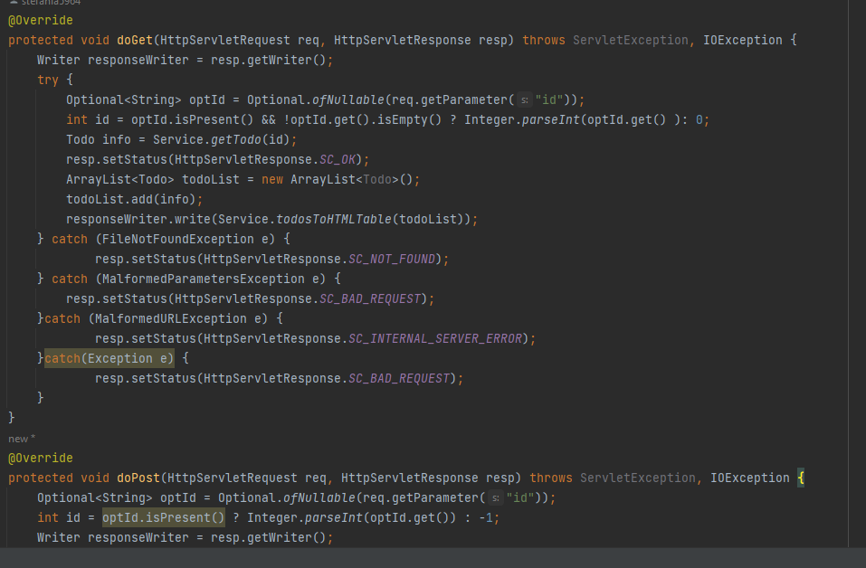
14.  Una vez hecho esto, verifique el funcionamiento de la aplicación, recompile y ejecute la aplicación.
15.  Intente hacer diferentes consultas desde un navegador Web para probar las diferentes funcionalidades.

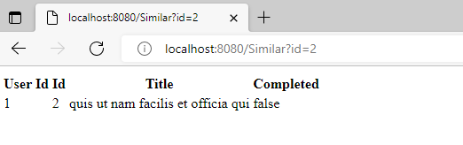

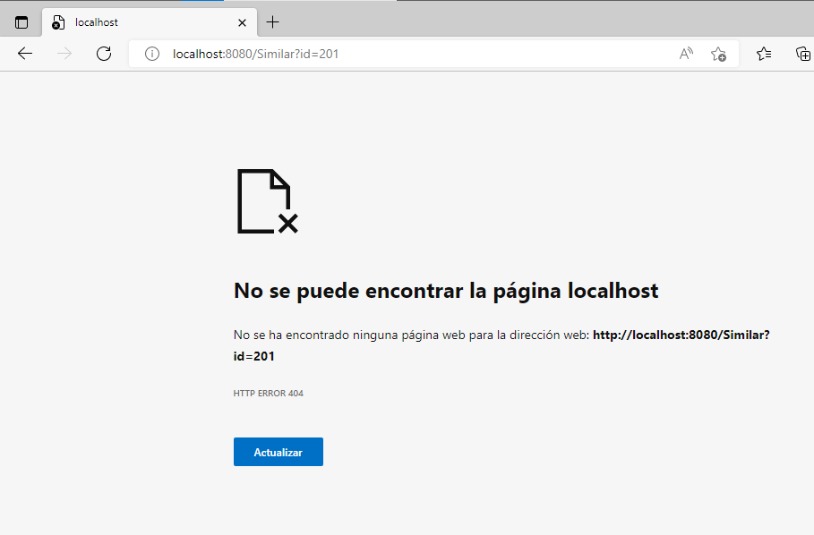
    
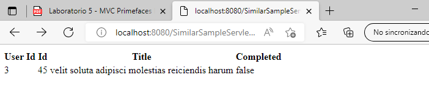
# Parte III.

16.  En su servlet, sobreescriba el método doPost, y haga la misma implementación del doGet.
17.  Cree el archivo `index.html` en el directorio `src/main/webapp/index.html` de la siguiente manera:
    
    ```
    <!DOCTYPE html>
    <html>
        <head>
            <title>Start Page</title>
            <meta http-equiv="Content-Type" content="text/html; charset=UTF-8">
        </head>
        <body>
            <h1>Hello World!</h1>
        </body>
    </html>
    ```
 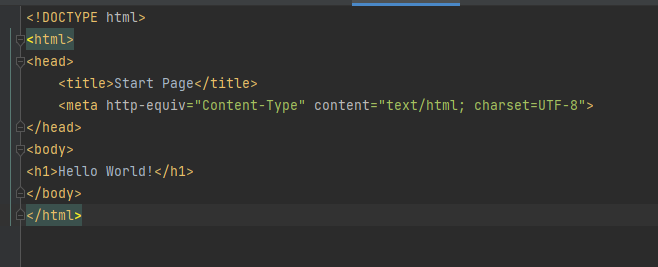   
18.  En la página anterior, cree un formulario que tenga un campo para ingresar un número (si no ha manejado html antes, revise http://www.w3schools.com/html/ ) y un botón. El formulario debe usar como método ‘POST’, y como acción, la ruta relativa del último servlet creado (es decir la URL pero excluyendo ‘http://localhost:8080/’).
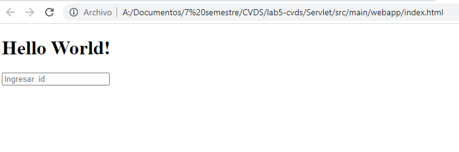
19.  Revise [este ejemplo de validación de formularios con javascript](http://www.w3schools.com/js/js_validation.asp) y agruéguelo a su formulario, de manera que -al momento de hacer ‘submit’- desde el browser se valide que el valor ingresado es un valor numérico.

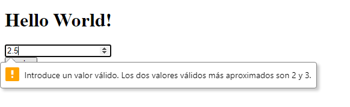


20.  Recompile y ejecute la aplicación. Abra en su navegador en la página del formulario, y rectifique que la página hecha anteriormente sea mostrada. Ingrese los datos y verifique los resultados. Cambie el formulario para que ahora en lugar de POST, use el método GET . Qué diferencia observa?
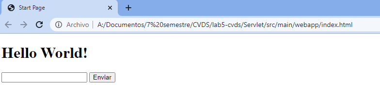
21.  ¿Qué se está viendo? Revise cómo están implementados los métodos de la clase Service.java para entender el funcionamiento interno.
-Ninguna
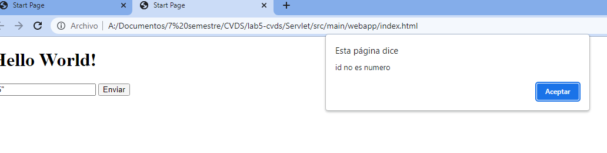
# Parte IV. - Frameworks Web MVC – Java Server Faces / Prime Faces

En este ejercicio, usted va a desarrollar una aplicación Web basada en el marco JSF, y en una de sus implementaciones más usadas: [PrimeFaces](http://primefaces.org/). Se trata de un juego en línea para adivinar un número, en el que el ganador, si atina en la primera oportunidad, recibe `$100.000`. Luego, por cada intento fallido, el premio se reduce en `$10.000`.

1.  Al proyecto Maven, debe agregarle las dependencias mas recientes de `javax.javaee-api`, `com.sun.faces.jsf-api`, `com.sun.faces.jsf-impl`, `javax.servlet.jstl` y Primefaces (en el archivo pom.xml).
    
2.  Para que configure automáticamente el descriptor de despliegue de la aplicación (archivo web.xml), de manera que el _framework_ JSF se active al inicio de la aplicación, en el archivo `web.xml` agregue la siguiente configuración:
    
    ```
    <servlet>
       <servlet-name>Faces Servlet</servlet-name>
       <servlet-class>javax.faces.webapp.FacesServlet</servlet-class>
       <load-on-startup>1</load-on-startup>
    </servlet>
    <servlet-mapping>
       <servlet-name>Faces Servlet</servlet-name>
       <url-pattern>/faces/*</url-pattern>
    </servlet-mapping>
    <welcome-file-list>
       <welcome-file>faces/index.jsp</welcome-file>
    </welcome-file-list>
    ```
   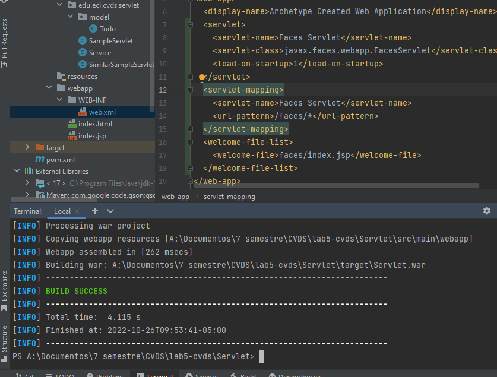 
3.  Revise cada una de las configuraciones agregadas anteriormente para saber qué hacen y por qué se necesitan. Elimine las que no se necesiten.
```
    - JavaEE-API: Es un estándar de mensajería que permite que los componentes de la aplicación Java EE creen, envíen, reciban y lean mensajes.
    - Jsf-api: Es un marco de interfaz de usuario basado en componentes del lado del servidor.
    - Jsf-impl: Contienen la implementación con código funcional y no clases abstractas e interfaces
    - jstl: Contiene etiquetas para el html que permiten encapsular determinadas acciones.
```
4.  Ahora, va a crear un `Backing-Bean` de sesión, el cual, para cada usuario, mantendrá de lado del servidor las siguientes propiedades:
    
    1.  El número que actualmente debe adivinar (debe ser un número aleatorio).
        
    2.  El número de intentos realizados.
        
    3.  El premio acumulado hasta el momento.
        
    4.  El estado del juego, que sería una cadena de texto que indica si ya ganó o no, y si ganó de cuanto es el premio.
        
    
    Para hacer esto, cree una clase que tenga:
    
    -   el constructor por defecto (sin parámetros)
    -   los métodos `get/set` necesarios dependiendo si las propiedades son de escritura o lectura
    -   coloque las anotaciones:
        -   `@ManagedBean`, incluyendo el nombre: `@ManagedBean(name = "guessBean")`.
        -   `@ApplicationScoped`.
    
    A la implementación de esta clase, agregue los siguientes métodos:
    -   `guess`: Debe recibir un intento de adivinanza y realizar la lógica para saber si se adivinó, de tal forma que se ajuste el valor del premio y/o actualice el estado del juego.
    -   `restart`: Debe volver a iniciar el juego (inicializar de nuevo el número a adivinar, y restaurar el premio a su valor original).
5.  Cree una página XHTML, de nombre `guess.xhtml` (debe quedar en la ruta `src/main/webapp`). Revise en la [página 13 del manual de PrimeFaces](http://www.primefaces.org/docs/guide/primefaces_user_guide_5_2.pdf), qué espacios de nombres XML requiere una página de PrimeFaces y cuál es la estructura básica de la misma.
    
6.  Con base en lo anterior, agregue un formulario con identificador `guess_form` con el siguiente contenido básico:
    
    ```
    <h:body>
     <h:form id="guess_form">
    
     </h:form>
    </h:body>
    ```
    
7.  Al formulario, agregue:
    
    1.  Un elemento de tipo `<p:outputLabel>` para el número que se debe adivinar, sin embargo, este elemento se debe ocultar. Para ocultarlo, se puede agregar el estilo `display: none;` al elemento. Una forma de hacerlo es por medio de la propiedad `style`.
        -   En una aplicacion real, no se debería tener este elemento, solo se crea con el fin de simplificar una prueba futura.
    2.  Un elemento `<p:inputText>` para que el usuario ingrese su número.
        
    3.  Un elemento de tipo `<p:outputLabel>` para mostrar el número de intentos realizados.
        
    4.  Un elemento de tipo `<p:outputLabel>` para mostrar el estado del juego.
        
    5.  Un elemento de tipo `<p:outputLabel>` para mostrar en cuanto va el premio.
        
        Y asocie dichos elementos al BackingBean de sesión a través de su propiedad `value`, y usando como referencia el nombre asignado:
        
        ```
        value="#{guessBean.nombrePropiedad}"
        ```
        
8.  Al formulario, agregue dos botones de tipo `<p:commandButton>`, uno para enviar el número ingresado y ver si se _atinó_, y otro para reiniciar el juego.
    
    1.  El botón de _envío de adivinanza_ debe tener asociado a su propiedad `update` el nombre del formulario en el que se agregaron los campos antes descritos, de manera que al hacer clic, se ejecute un ciclo de JSF y se _refresque_ la vista.
        
    2.  Debe tener también una propiedad `actionListener` con la cual se le indicará que, al hacer clic, se ejecutará el método `guess`, creado en el backing-bean de sesión:
        
        ```
        <p:commandButton update="guess_form" actionListener="#{guessBean.guess}">...
        ```
        
    3.  El botón de reiniciar juego tendrá las mismas propiedades de `update` y `actionListener` del otro con el valor correspondiente:
        
        ```
        <p:commandButton update="…" actionListener="…">
        ```
        
9.  Para verificar el funcionamiento de la aplicación, agregue el plugin tomcat-runner dentro de los plugins de la fase de construcción (build). Tenga en cuenta que en la configuración del plugin se indica bajo que ruta quedará la aplicación:
    
    1.  mvn package
        
    2.  mvn tomcat7:run
        
    
    Si no hay errores, la aplicación debería quedar accesible en la URL: [http://localhost:8080/faces/guess.xhtml](http://localhost:8080/faces/guess.xhtml)
    
10.  Si todo funcionó correctamente, realice las siguientes pruebas:


        1.  Abra la aplicación en un explorador. Realice algunas pruebas con el juego e intente adivinar el número.


     2.  Abra la aplicación en dos computadores diferentes. Si no dispone de uno, hágalo en dos navegadores diferentes (por ejemplo Chrome y Firefox; incluso se puede en un único navegador usando una ventana normal y una ventana de incógnito / privada). Haga cinco intentos en uno, y luego un intento en el otro. ¿Qué valor tiene cada uno?
     Los valores de los intentos no son independientes.


    3.  Aborte el proceso de Tomcat-runner haciendo Ctrl+C en la consola, y modifique el código del backing-bean de manera que use la anotación @SessionScoped en lugar de @ApplicationScoped. Reinicie la aplicación y repita el ejercicio anterior.
        -   ¿Coinciden los valores del premio?.
        -   Dado la anterior, ¿Cuál es la diferencia entre los backing-beans de sesión y los de aplicación?
        Con los de sesion cada pagina es indepentdiente.


    4.  Por medio de las herramientas de desarrollador del explorador (Usando la tecla "F12" en la mayoría de exploradores):
        -   Ubique el código HTML generado por el servidor.
        -   Busque el elemento oculto, que contiene el número generado aleatoriamente.
        -   En la sección de estilos, deshabilite el estilo que oculta el elemento para que sea visible.
        -   Observe el cambio en la página, cada vez que se realiza un cambio en el estilo.
        -   Revise qué otros estilos se pueden agregar a los diferentes elementos y qué efecto tienen en la visualización de la página.
        -   Actualice la página. Los cambios de estilos realizados desaparecen, pues se realizaron únicamente en la visualización, la respuesta del servidor sigue siendo la misma, ya que el contenido de los archivos allí almacenados no se ha modificado.
        -   Revise qué otros cambios se pueden realizar y qué otra información se puede obtener de las herramientas de desarrollador.

    ```
    <html xmlns="http://www.w3.org/1999/xhtml"><head></head><body>
        <h1>Juego adivinanza</h1>
<form id="guess_form" name="guess_form" method="post" action="/faces/guess.xhtml" enctype="application/x-www-form-urlencoded">
<input type="hidden" name="guess_form" value="guess_form">

            <label><h1>Ingrese numero entre 1 y 20</h1></label><br><input id="guess_form:num" name="guess_form:num" type="text" value="0" class="ui-inputfield ui-inputtext ui-widget ui-state-default ui-corner-all " aria-required="true" placeholder="Numero entre 1 y 20" size="20"><script id="guess_form:num_s" type="text/javascript">$(function(){PrimeFaces.cw("InputText","widget_guess_form_num",{id:"guess_form:num"});});</script>
            <br><button id="guess_form:j_idt7" name="guess_form:j_idt7" class="ui-button ui-widget ui-state-default ui-corner-all ui-button-text-only" onclick="PrimeFaces.ab({s:&quot;guess_form:j_idt7&quot;,f:&quot;guess_form&quot;,u:&quot;guess_form&quot;});return false;" type="submit"><span class="ui-button-text ui-c">Enviar</span></button><script id="guess_form:j_idt7_s" type="text/javascript">$(function(){PrimeFaces.cw("CommandButton","widget_guess_form_j_idt7",{id:"guess_form:j_idt7"});});</script>
            <p><b>Premio Actual</b></p><label id="guess_form:j_idt9" class="ui-outputlabel ui-widget">100000</label>
            <br>
            <p><b>Intentos</b></p><label id="guess_form:j_idt11" class="ui-outputlabel ui-widget">0</label>
            <br>
            <p><b>Numero</b></p><label id="guess_form:j_idt13" class="ui-outputlabel ui-widget">2</label>
            <br>
            <p><b>Estado de juego</b></p><label id="guess_form:j_idt15" class="ui-outputlabel ui-widget"></label>
            <br><button id="guess_form:j_idt17" name="guess_form:j_idt17" class="ui-button ui-widget ui-state-default ui-corner-all ui-button-text-only" onclick="PrimeFaces.ab({s:&quot;guess_form:j_idt17&quot;,f:&quot;guess_form&quot;,u:&quot;guess_form&quot;});return false;" type="submit"><span class="ui-button-text ui-c">Reset</span></button><script id="guess_form:j_idt17_s" type="text/javascript">$(function(){PrimeFaces.cw("CommandButton","widget_guess_form_j_idt17",{id:"guess_form:j_idt17"});});</script><input type="hidden" name="javax.faces.ViewState" id="j_id1:javax.faces.ViewState:0" value="-9189921226440907258:1382762079137429313" autocomplete="off">
</form>
    
</body></html>
    ```
11.  Para facilitar los intentos del usuario, se agregará una lista de los últimos intentos fallidos realizados:
    
    1.  Agregue en el `Backing-Bean`, una propiedad que contenga una lista de intentados realizados.
        
    2.  Agregue cada intento a la lista, cuando se ejecute el método `guess`.
        
    3.  Cuando se reinicie el juego, limpie el contenido de la lista.
        
    4.  Busque cómo agregar una tabla a la página, cuyo contenido sea los últimos intentos realizados.
        

## Entrega

-   Dentro del directorio coloque un archivo de texto `integrantes.txt` con el nombre de los integrantes del taller (máximo 2).
-   configurar el archivo `.gitignore` para excluir del repositorio los archivos no relevantes.
-   Realizar un diagrama de clases del proyecto.
-   En un archivo de texto coloque las respuestas a las preguntas de la parte 3 (diferencias encontradas entre usar un GET o un POST, qué otros métodos similares existen y para qué es cada uno, información del punto 20 y 21).
   